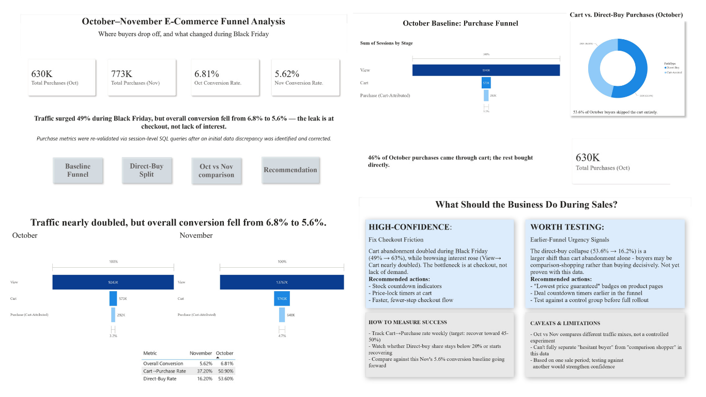

# E-Commerce Funnel Analysis: Black Friday

Where buyers drop off, and what changed during Black Friday.

[Learn more ↓](#scenario)

---

## Dashboard

---

**Project Name:** E-Commerce Funnel Analysis: Black Friday

**Project Type:** Data Analytics / BI Case Study
**Tools Used:** Power BI Desktop, SQL, BigQuery (session-level validation)

## Scenario

- Analyzed customer session data from an e-commerce platform across October and November
- Goal: understand how the Black Friday sale period affected buying behavior
- Traffic surged 49% in November, but overall conversion dropped from 6.81% to 5.62%
- Investigated *where* in the funnel the drop happened and *why*

## Summary

- October: 630K total purchases, 6.81% overall conversion
- November: 773K total purchases, 5.62% overall conversion
- Traffic nearly doubled (View: 9.24M → 13.77M), but conversion fell rather than held steady
- Cart→Purchase rate dropped sharply: 50.90% (Oct) → 37.20% (Nov)
- Direct-buy rate collapsed: 53.60% (Oct) → 16.20% (Nov)
- **Finding:** the leak is at checkout, not a lack of buyer interest

## Key Challenges & Solutions

- **Challenge:** Initial purchase totals didn't reconcile with expectations — a data discrepancy was found in how purchases were being counted
- **Solution:** Re-validated all purchase metrics via session-level SQL/BigQuery queries before trusting downstream numbers
- This re-validation is what surfaced the real signal: a checkout leak, not lower demand

## What I Learned

- Aggregate metrics can hide the real story — a falling overall conversion rate looked like "the sale underperformed"
- Breaking the funnel into View → Cart → Purchase showed rising interest alongside a checkout-specific leak
- Learned to validate data before trusting it, rather than building conclusions on unchecked numbers
- Learned to separate "high-confidence" findings from "worth testing" hypotheses instead of presenting every conclusion with equal certainty

## Why It Matters

- Retailers often read a Black Friday conversion dip as "the promotion underperformed" and cut spend or urgency tactics as a result
- This data supports the opposite conclusion — buyer interest actually rose
- The real leak was checkout friction under higher cart volume, not weaker demand
- This kind of funnel-stage breakdown is what separates a vanity-metric dashboard from one that tells a business what to actually fix

## Recommendations

**High-confidence — Fix Checkout Friction**
- Cart abandonment doubled during Black Friday (49% → 63%) while View→Cart interest rose
- Recommended actions: stock countdown indicators, price-lock timers at cart, faster fewer-step checkout flow

**Worth testing — Earlier-Funnel Urgency Signals**
- The direct-buy collapse (53.6% → 16.2%) is a larger shift than cart abandonment alone
- Recommended actions: "lowest price guaranteed" badges on product pages, deal countdown timers earlier in the funnel, test against a control group before full rollout

## Caveats & Limitations

- Oct vs Nov compares different traffic mixes, not a controlled experiment
- Can't fully separate "hesitant buyer" from "comparison shopper" in this data
- Based on one sale period; testing against another would strengthen confidence
